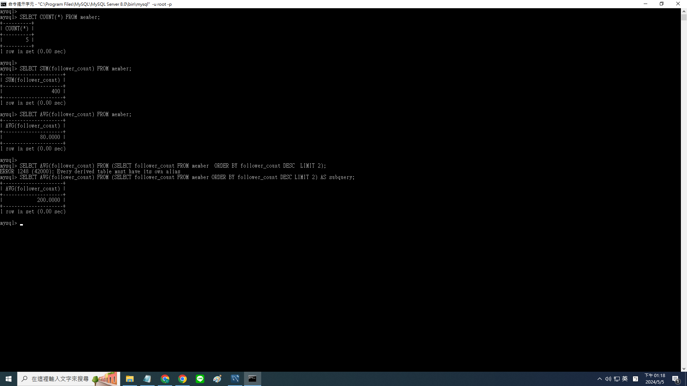

# Week 5 

## Task 2

```sql
CREATE DATABASE website;

USE website;
CREATE TABLE member(
  id BIGINT PRIMARY KEY AUTO_INCREMENT,
  name VARRCHAR(255) not null,
  username VARRCHAR(255) not null,
  password VARRCHAR(255) not null,
  follower_count INT UNSIGNED not null DEFAULT 0,
  time DATETIME not null DEFAULT CURRENT_TIMESTAMP
);
```


## Task 3
```sql
INSERT INTO member(name, username, password) VALUES('test', 'test', 'test');
INSERT INTO member(name, username, password) VALUES('Amy Lin', 'user1', 'abc123');
INSERT INTO member(name, username, password) VALUES('Bob Lee', 'user2', 'abc456');
INSERT INTO member(name, username, password) VALUES('John Chen', 'user3', 'abc789');
INSERT INTO member(name, username, password) VALUES('emma Chen', 'user4', 'abc000');

SELECT * FROM member;
SELECT * FROM member ORDER BY time DESC;
SELECT * FROM member ORDER BY time DESC LIMIT 1,3;
SELECT * FROM member WHERE username='test';
```


## Task 3
```sql
SELECT * FROM member WHERE name LIKE '%es%';
SELECT * FROM member WHERE username='test' AND password='test';
UPDATE member SET name='test2' WHERE username='test';
SELECT * FROM member
```


## Task 4
```sql
SELECT COUNT(*) FROM member;

SELECT SUM(follower_count) FROM member;

SELECT AVG(follower_count) FROM member;

SELECT AVG(follower_count) FROM (SELECT follower_count FROM member ORDER BY follower_count DESC LIMIT 2) AS subquery;
```



## Task 5
```sql
USE website;
CREATE TABLE message (
    id BIGINT PRIMARY KEY AUTO_INCREMENT,
    member_id BIGINT NOT NULL,
    FOREIGN KEY (member_id) REFERENCES member(id)
    content VARCHAR(255) NOT NULL,
    like_count INT UNSIGNED DEFAULT 0,
    time DATETIME NOT NULL DEFAULT CURRENT_TIMESTAMP,
);

INSERT INTO message(member_id, content, like_count) VALUES('1','00000', '30');
INSERT INTO message(member_id, content, like_count) VALUES('2','11111', '20');
INSERT INTO message(member_id, content, like_count) VALUES('3','22222', '40');
INSERT INTO message(member_id, content, like_count) VALUES('4','33333', '66');
INSERT INTO message(member_id, content, like_count) VALUES('1','zzzzz', '10');

SELECT message.*, member.name AS sender_name FROM message JOIN member ON message.member_id = member.id;

SELECT message.*, member.name AS sender_name FROM message JOIN member ON message.member_id=member.id WHERE username='test';

SELECT AVG(message.like_count) AS avg_like_count FROM message INNER JOIN member ON message.member_id = member.id WHERE member.username = 'test';

SELECT member.username AS sender_username, AVG(message.like_count) AS avg_like_count FROM message JOIN member ON message.member_id = member.id GROUP BY member.username;

```

